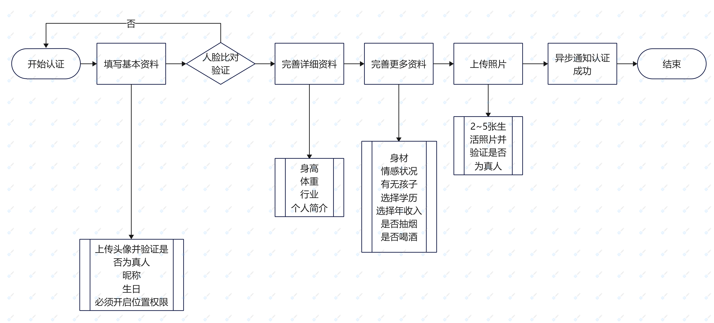

### 接口设计  
_接口均为原后台人员设计，如有疑问，可联系我进行沟通、修改。_  
_由于接口均为反推，所以顺序并非开发顺序_
#### 女生认证
> ##### 流程


>### 1.填写基本资料
+ 地址 v1/accounts/{uuid}
+ 请求方式：put
+ 参数
|  名称   | 提交方式  | 数据格式 | 说明  |
| ---- | ---- | ---- | ---- |
| uuid | path | str |  |
|avatar | body | str| 头像 |
| nickname | body | str |  昵称  |
| birthday | body | str | 生日 |
| region | body | str | 所在区域，城市 |
+ 请求示例
```json
  //put v1/accounts/用户uuid
  {
    "avatar":"头像地址",//上传图片请参考通用部分上传图片文档
    "nickname":"昵称",
    "birthday":"2012-02-02",
    "region":"北京"
  }
```
+ 返回值
```
  {
  "code":"1007",
  "message":"success"
}
```

>### 2.人脸认证
待定

>### 3.填写基本资料
+ 地址 v1/accounts/{uuid}
+ 请求方式：put
+ 参数
|  名称   | 提交方式  | 数据格式 | 说明  |
| ---- | ---- | ---- | ---- |
| uuid | path | str |  |
| height | body | str| 身高 |
| weight | body | str |  体重  |
| job | body | str | 职业 |
| intro | body | str | 签名 |
+ 请求示例
```json
  //put v1/accounts/用户uuid
  {
    "height":"170cm",//上传图片请参考通用部分上传图片文档
    "weight":"50kg",
    "job":"护士",
    "intro":"这是个签名"
  }
```
+ 返回值
```
  {
  "code":"1007",
  "message":"success"
}
```
>### 4.填写更多资料
+ 地址 v1/accounts/{uuid}
+ 请求方式：put
+ 参数
|  名称   | 提交方式  | 数据格式 | 说明  |
| ---- | ---- | ---- | ---- |
| uuid | path | str |  |
| figure | body | str| 身材 |
| emotion | body | str |  情感状况  |
| child | body | str | 是否有孩子 |
| education | body | str | 学历 |
| income | body | str| 年收入 |
| smoke | body | str |  是否吸烟  |
| drink | body | str | 是否饮酒 |
+ 请求示例
```json
  //put v1/accounts/用户uuid
  {
    "figure":"丰满",
    "emotion":"未婚",
    "child":"无",
    "education":"本科",
    "income":"收入",
    "smoke":"否",
    "drink":"否"
  }
```
+ 返回值
```
  {
  "code":"1007",
  "message":"success"
}
```

>### 5.上传照片
上传照片请参考上传照片部分，此处type为user_photo
+ 地址 v2/accounts/{uuid}/resource
+ 请求方式：post
+ 参数
|  名称   | 提交方式  | 数据格式 | 说明  |
| ---- | ---- | ---- | ---- |
| uuid | path | str |  |
| avatar | body | str| 头像 |
| photos | body | list |  照片集合  |
+ 请求示例
```json
  //put v1/accounts/用户uuid
  {
    "avatar":"头像地址",
    "photos":[
      {
        "url":"照片地址",
        "type":"image|video",//这里只能传image
        "pay_type":"red_packet红包|fire阅后即焚|free免费"
      }
    ]
  }
```
+ 返回值
```
  {
  "code":"1007",
  "message":"success"
}
```
>### 6.审核结果
由于不清楚是否能同步审核完成，我们之前采用异步方式，利用云信自定义消息通知客户端是否审核成功，这里策略待定。

#### 男生认证
男生认证只要头像与人脸对应上就算认证成功，目前由于不清楚人脸如何搞，暂时待定。
